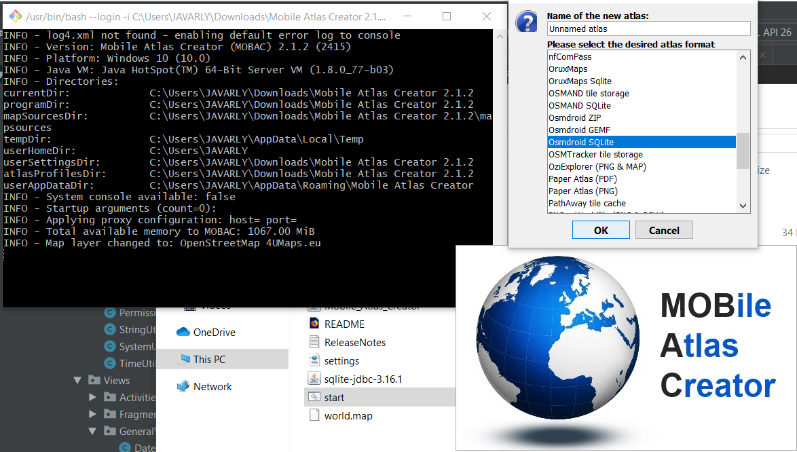
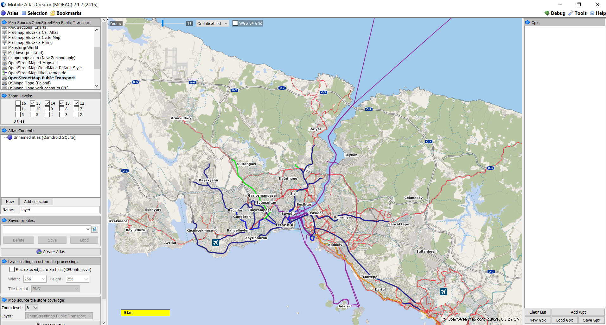
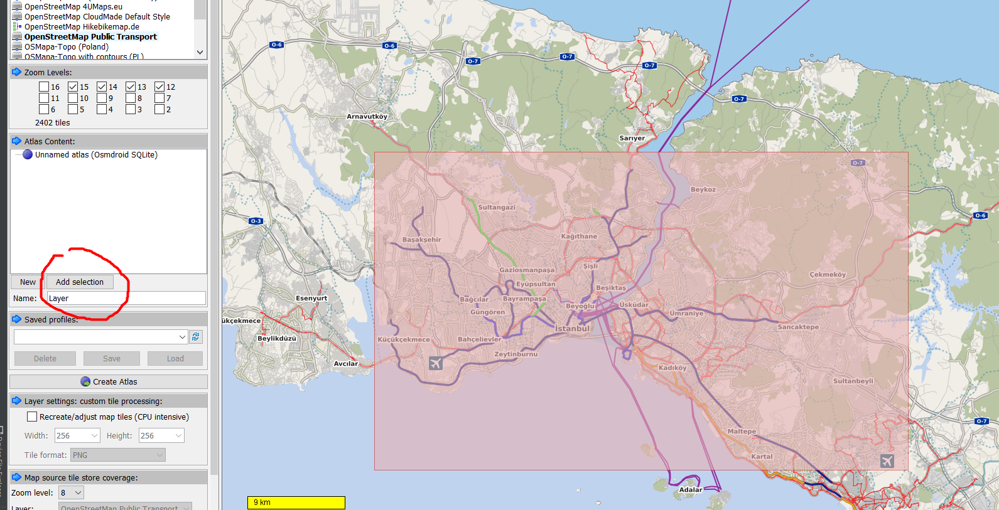
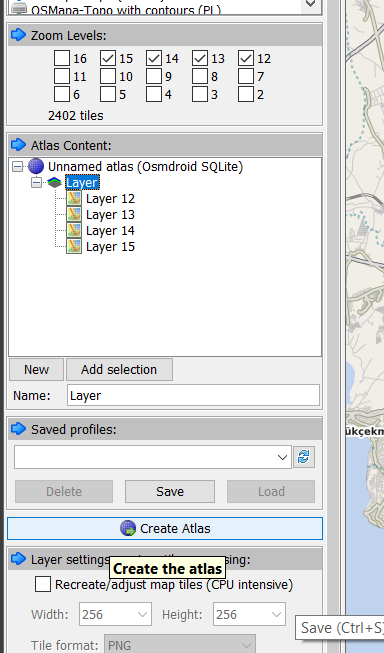
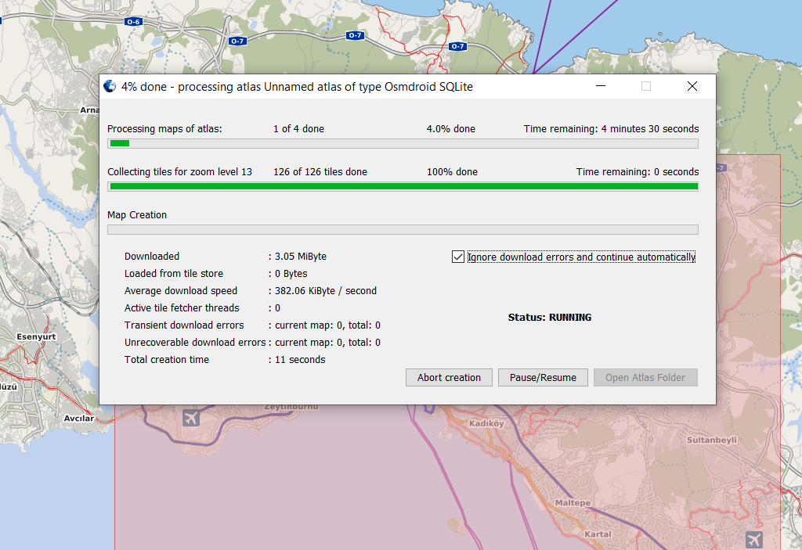
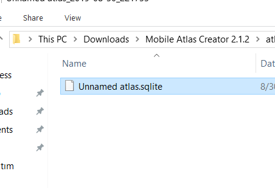
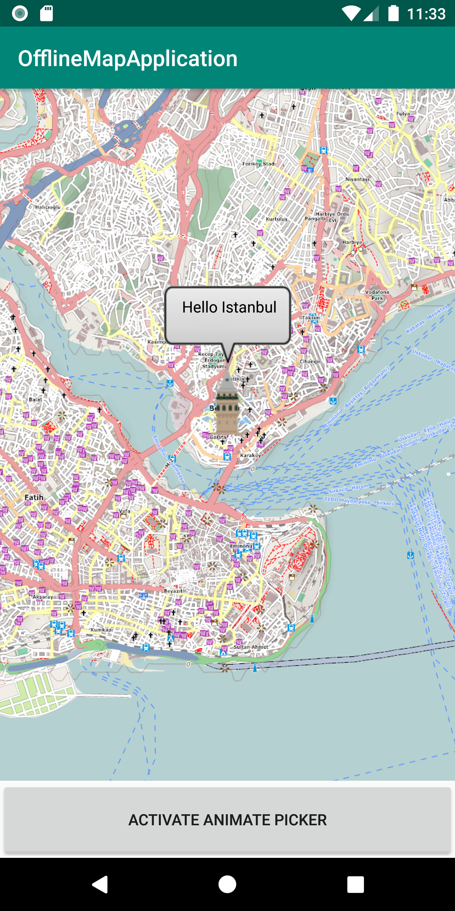

# AndroidOfflineMapLibrary
Offline OpenStreet Map Library (No Internet Required) You dont have to even one-time connect!

> Offline OpenStreetMap Library

> Performance friendly and scalable

#### [DETAILED MEDIUM POST](https://medium.com/@asynctaskcoffee/android-openstreetmap-offline-map-setup-8c71eee40088) 

## Why this project exists

Offline map usage is kind a problem for developers and there are rare documentations. I believe this library will helpful for developers. 

## Features and Usage

### Implementation
 
You need to download offline map-tiles as SQLite format. And you should put it under assets folder. Let me explain how to download offline map-tiles step-by-step;

##### 1. First you need to download Mobile Atlas Creator from [HERE](https://sourceforge.net/projects/mobac/files/Mobile%20Atlas%20Creator/MOBAC%202.0/Mobile%20Atlas%20Creator%202.1.2.zip/download) 

##### 2. Open MOBAC and select Osmdroid SQLite
 

##### 3. Select map source (selecting osm is better) and zoom-levels (15-14-13-12 are ideal) as you desire from left panel. 
 

##### 4. Draw a area (small areas consume less storage). And press add selection button from left panel.
 

##### 5. As you can see layers are selected. After selecting layers press Create Atlas button. 
 

##### 6. Select 'Ignore download errors and continue automatically' and continue.


##### 7. After finishing download process rename the SQLite file as 'map.sqlite' and copy it into assets folder.
 

##### 8. And yes! You completed the hard part. Rest of the steps just coding few lines.

#### Java 

```java
public class MainActivity extends AppCompatActivity implements MapListener, GeoPointListener {

    OfflineMapView offlineMapView;
    MapUtils mapUtils;

    @Override
    protected void onCreate(Bundle savedInstanceState) {
        super.onCreate(savedInstanceState);
        setContentView(R.layout.activity_main);
        offlineMapView = findViewById(R.id.map);
        offlineMapView.init(this, this);
    }


    @Override
    public void mapLoadSuccess(MapView mapView, MapUtils mapUtils) {

        // GeoPoint belongs to ISTANBUL heart of the world :)
        this.mapUtils = mapUtils;
        offlineMapView.setInitialPositionAndZoom(new GeoPoint(41.025135, 28.974101), 14.5);

        // 41.025135, 28.974101 Galata Tower

        Marker marker = new Marker(mapView);
        marker.setPosition(new GeoPoint(41.025135, 28.974101));
        marker.setIcon(getResources().getDrawable(R.drawable.galata_tower));

        // marker.setImage(drawable);

        marker.setTitle("Hello Istanbul");
        marker.showInfoWindow();
        mapView.getOverlays().add(marker);
        mapView.invalidate();
    }

    @Override
    public void mapLoadFailed(String ex) {
        Log.e("ex:", ex);
    }

    @Override
    public void onGeoPointRecieved(GeoPoint geoPoint) {

        //Selected GeoPoint Returns Here

        Toast.makeText(this, geoPoint.toDoubleString(), Toast.LENGTH_SHORT).show();
    }

    public void activateAnimatePicker(View view) {
        if (mapUtils != null)
            offlineMapView.setAnimatedLocationPicker(true, this, mapUtils);
    }
}
```

#### Kotlin
```kotlin
class MainActivityKotlin : AppCompatActivity(), MapListener, GeoPointListener {

    lateinit var offlineMapView: OfflineMapView

    override fun onCreate(savedInstanceState: Bundle?) {
        super.onCreate(savedInstanceState)
        setContentView(R.layout.activity_main_kotlin)
        offlineMapView = findViewById(R.id.map)
        offlineMapView.init(this, this)
    }

    @SuppressLint("ShowToast")
    override fun onGeoPointRecieved(geoPoint: GeoPoint?) {

        //Selected GeoPoint Returns Here

        Toast.makeText(this, geoPoint?.toDoubleString(), Toast.LENGTH_SHORT).show()
    }

    override fun mapLoadSuccess(mapView: MapView?, mapUtils: MapUtils?) {

        // GeoPoint belongs to ISTANBUL heart of the world :)

        offlineMapView.setInitialPositionAndZoom(GeoPoint(41.011099, 28.996885), 15.5)
        offlineMapView.setAnimatedLocationPicker(true, this, mapUtils)

        
    }

    override fun mapLoadFailed(ex: String?) {
        Log.e("ex", ex.orEmpty())
    }
}
```


#### Or XML
```xml    
<egolabsapps.basicodemine.offlinemap.Views.OfflineMapView
        android:id="@+id/map"
        android:layout_width="match_parent"
        android:layout_height="match_parent"
        app:initialFocusLatitude="41.025818"
        app:initialFocusLongitude="28.973436"
        app:zoomLevel="15" />
```

###### Result: Say Hi to ISTANBUL :)

   


## Implementation

###### Add it in your root build.gradle at the end of repositories

```groovy
    repositories {
        maven { url 'https://jitpack.io' }
    }
```

###### Add the dependency

```groovy
    implementation 'com.github.AsynctaskCoffee:AndroidOfflineMapLibrary:v1'
    implementation 'com.github.MKergall:osmbonuspack:6.6.0'
    implementation 'org.osmdroid:osmdroid-android:6.1.0'
```


## Update 20.01.2021

Please add android:requestLegacyExternalStorage="true" in your manifest file.


## License

```
   Copyright 2019 Egemen ÖZOGUL

   Licensed under the Apache License, Version 2.0 (the "License");
   you may not use this file except in compliance with the License.
   You may obtain a copy of the License at

       http://www.apache.org/licenses/LICENSE-2.0

   Unless required by applicable law or agreed to in writing, software
   distributed under the License is distributed on an "AS IS" BASIS,
   WITHOUT WARRANTIES OR CONDITIONS OF ANY KIND, either express or implied.
   See the License for the specific language governing permissions and
   limitations under the License.
```
